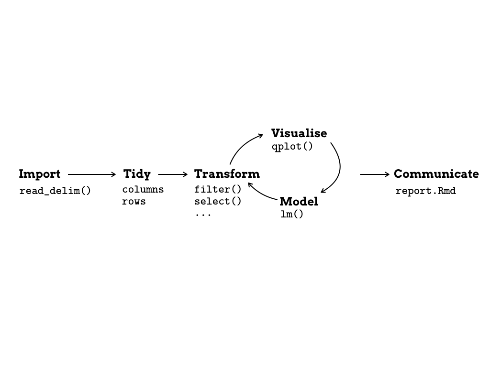
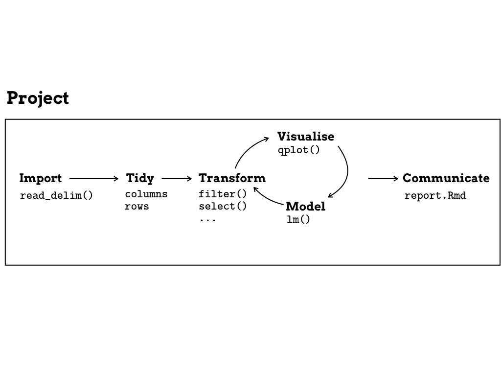
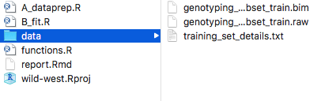

<!-- 
<!-- From here: https://slides.yihui.name/xaringan/ -->

```{r setup, include=FALSE}
options(htmltools.dir.version = FALSE)
library <- function(...) suppressPackageStartupMessages(base::library(...))
knitr::opts_chunk$set(
  tidy = TRUE
)
```

---
layout: true


---
class: left, middle
exclude: true

# About me

- Background in Data Analysis & Engineering

- What I do: Postdoc @ EPFL `r icon::ii_arrow_right_a()` Analysis of genetic data in infectious diseases at the [Fellay Lab](https://fellay-lab.epfl.ch/).

- What I did in the past: research assistant in data science, as a biostatistician and as a PhD student in statistical genetics. 


---
class: left, middle




.small[Adapted from Figure in [R4DS book](http://r4ds.had.co.nz/explore-intro.html)]

---
class: left, middle




.small[Adapted from Figure in [R4DS book](http://r4ds.had.co.nz/explore-intro.html)]


---
class: left, top

# The challenges

## Reproducibility

- Making it easy for others to **rerun** and to **understand** the project.

--

## Optimising computation

- Keeping **computation at minimum**.


---
class: left, top

# Solutions

- GNU Make (cumbersome, each target is a file)

- R-package ProjectTemplate (useful for organisation)

- Knitr/RMarkdown (does not scale)

- Drake ...


---
class: left, middle

# Drake

*drake = Data Frames in R for Make*

<a href="http://r-pkgs.had.co.nz/package.html">

</a>

- [rOpenSci R-package](https://github.com/ropensci/drake) created by [Will Landau](https://github.com/wlandau), with contributions from many others.


- "general-purpose workflow manager for data-driven tasks"


---
class: left, middle

## Benefits

- **Clear instructions** → one file contains the **recipe** of the analysis.

- **Modular code** → using **functions** instead of free floating code.

- **Minimising** redundant computation → **caching** results.


---
class: left, top

# Syntax

## 1. Create a file make.R

```
create_plot <- function(data) {
  ggplot(data, aes(x = Petal.Width, fill = Species)) +
    geom_histogram()
}

plan <- drake_plan(
  raw_data = readxl::read_excel(file_in("raw_data.xlsx")),
  data = raw_data %>%
    mutate(Species = forcats::fct_inorder(Species)) %>%
    select(-X__1),
  hist = create_plot(data),
  fit = lm(Sepal.Width ~ Petal.Width + Species, data),
  report = rmarkdown::render(
    knitr_in("report.Rmd"),
    output_file = file_out("report.html"),
    quiet = TRUE
  )
)

```


---
class: left, top

# Syntax

## 2. make()

```
make(plan)
```

## 3. Access generated objects

- `readd(fit)` to display target.
- `loadd(fit)` to load target into R session.

---
class: left, top

# Syntax

## 4. Other functions

- [`drake_tip()`](https://ropensci.github.io/drake/reference/drake_tip.html)

- See complete list of functions [here](https://ropensci.github.io/drake/reference/index.html).

- Checkout [cheatsheet](https://github.com/krlmlr/drake-sib-zurich/blob/master/cheat-sheet.pdf).

- To get familiar with drake, run `drake::drake_example("main")`

---
class: left, top

# Tidytuesday week 24 without drake

### Link to example

https://github.com/sinarueeger/20181210-rladies-lausanne/tree/master/examples/tidytuesday-no-drake

<!--- ------>

### Folder structure

```
tidytuesday-no-drake/
├── report
│   └── report.Rmd
├── src
│   ├── analysis.R
│   └── setup.R
├── README.md
├── runall.sh
└── tidytuesday-no-drake.Rproj
```

---
class: left, top

# Tidytuesday week 24 with drake

### Link to example

https://github.com/sinarueeger/20181210-rladies-lausanne/tree/master/examples/tidytuesday-with-drake

### Folder structure

```
tidytuesday-with-drake/
├── src
│   ├── functions.R
│   └── setup.R
├── make.R
├── README.md
├── report.Rmd
└── tidytuesday-with-drake.Rproj
```


---
class: left, middle

## Additional features

### Use high-performance computing with drake: 

- `make(plan, jobs = 4)`
- or with the `future` package

---
class: left, middle

## Downsides

- Might be tricky in collaborations (to get everyone to use drake)

- What if you have a complex folder structure? (you will need to create symlinks)

---
class: left, middle

## More drake resources

- [Github Repo](https://github.com/ropensci/drake)

- Lots of [tutorials](https://github.com/ropensci/drake#tutorials) and [examples](https://github.com/ropensci/drake#examples).

- [Best practices](https://ropensci.github.io/drake/articles/best-practices.html) for drake projects.


---
class: inverse, center, middle

.big[<font face="Yanone Kaffeesatz"> Thank you! </font>] <!------`r icon::fa_smile()` ---------->

.left[
Slides: [https://sinarueeger.github.io/20181210-rladies-lausanne/#1](https://sinarueeger.github.io/20181210-rladies-lausanne/#1)

Material: [https://github.com/sinarueeger/20181210-rladies-lausanne/](https://github.com/sinarueeger/20181210-rladies-lausanne/)


`r icon::fa_twitter(colour = "white")`: [@sinarueeger](https://twitter.com/sinarueeger)
]
